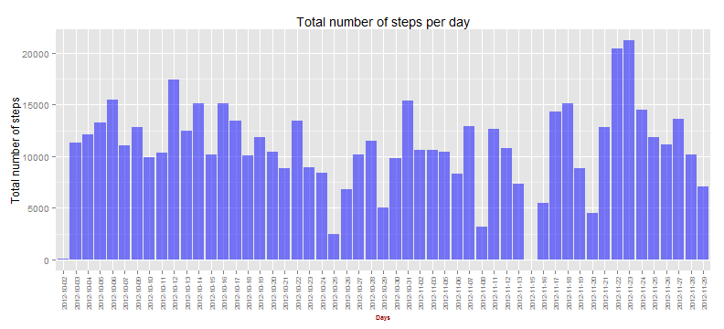
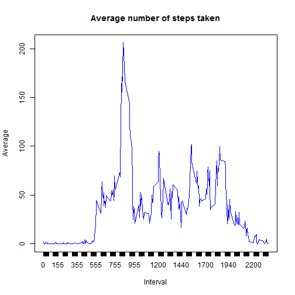
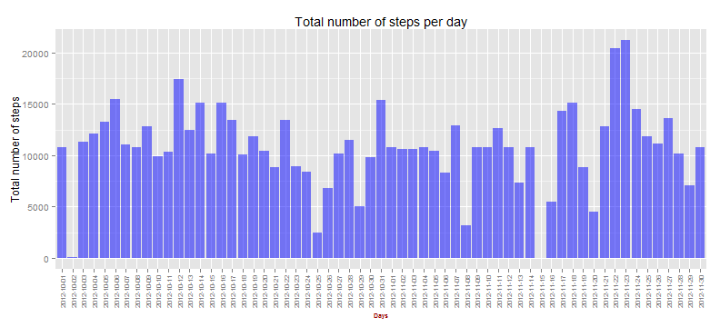
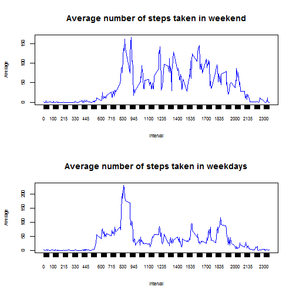

# Reproducible Research: Peer Assessment 1

## Introduction

This report try to analize the patterns for the data collected in a device at 5 minute intervals through out the day.

To do that I have followed the steps detailed below.

## Loading and preprocessing the data

The data has been collected in a zip file in the coursera's website.

### Let's first upload the data

```r
setInternet2(TRUE)

download.file("https://d396qusza40orc.cloudfront.net/repdata%2Fdata%2Factivity.zip", 
              destfile="activity.zip")
unzip("activity.zip", overwrite=TRUE)

fileName <- "Activity.csv"
dataSet.complete <- read.csv(file = fileName, stringsAsFactors = FALSE, sep = ",")
```

### Let's process / transform the data

First of all we are going to obtain the information without NAs


```r
dataSet <- dataSet.complete[!is.na(dataSet.complete$steps),]
```

## What is mean total number of steps taken per day?

Let's obtain the total number of steps per day and make a histogram to show it:


```r
total.day <- aggregate(steps ~ date, dataSet, sum)

library(ggplot2)

g <- ggplot(total.day, aes(x=date, y=steps))
p <- g + geom_histogram(stat="identity",size=1,alpha=0.5, fill = "blue") +
     labs(x = "Days", y="Total number of steps", title="Total number of steps per day")+
     theme(axis.title.x = element_text(face="bold", colour="#990000", size=7),
           axis.text.x  = element_text(angle=90, vjust=0.5, size=7))     
```

And this is the total number of steps per day

 

The mean total of steps taken per day is obtained with the following code:


```r
mean.total <- format(round(mean(total.day$steps),2),digits=10)
```
Mean = 10766.19

The median total of steps taken per day is obtained with the following code:

```r
median.total <- format(round(median(total.day$steps),2),digits=10)
```
Median = 10765


## What is the average daily activity pattern?

To see the average daily activity pattern we are going to make a time series of the 5-minute interval and the average number of steps taken, averaged accross all days.


```r
average.interval <- aggregate(steps ~ interval, dataSet, mean)

plot(average.interval$steps~average.interval$interval, type="l", 
     xlab = "Interval", ylab = "Average",
     main = "Average number of steps taken", col = "blue",
     xaxt = "n")
axis(side=1, at = average.interval$interval, labels = average.interval$interval)
```

 

You can see that the maximum number of steps for the 5-minute interval on average across all the days is:


```r
max.interval <- subset(average.interval,steps == max(average.interval$steps),interval)
max.steps = max(average.interval$steps)
```
Interval with the maximum steps is 835 with 206.1698 steps.

## Imputing missing values

As there are a number of days/intervals where there are missing values, this may introduce bias into some calculations or summaries of the data.

### Report of the total number of missing values in the dataset.


```r
dataSet.NAs <- dataSet.complete[is.na(dataSet.complete$steps),]
num.NAs <- nrow(dataSet.NAs)
```

Total number of missing values in the dataset is 2304


### Strategy for filling in all of the missing values in the dataset.

To avoid bias let's fill in all the missing values. The strategy is calculate the mean for that 5-minute interval.


```r
mean.interval <- aggregate(steps ~ interval, dataSet, mean)

for (i in 1:nrow(dataSet.NAs)) {
  mean.value <- subset(mean.interval, mean.interval$interval == dataSet.NAs[i,3])[1,2]
  if (is.na(mean.value)) dataSet.NAs[i,1] <- 0
  else dataSet.NAs[i,1] <- mean.value
}

dataSet.new <- rbind(dataSet, dataSet.NAs)
```

Let's show an histogram to show the total number of steps taken each day to compare with the information without non-available values.


```r
total.day <- aggregate(steps ~ date, dataSet.new, sum)
g <- ggplot(total.day, aes(x=date, y=steps))
p <- g + geom_histogram(stat="identity",size=1,alpha=0.5, fill = "blue") +
  labs(x = "Days", y="Total number of steps", title="Total number of steps per day")+
  theme(axis.title.x = element_text(face="bold", colour="#990000", size=7),
        axis.text.x  = element_text(angle=90, vjust=0.5, size=7)) 
```

 

The mean total of steps taken per day is obtained with the following code:


```r
mean.total <- format(round(mean(total.day$steps),2),digits=10)
```

Mean = 10766.19

The median total of steps taken per day is obtained with the following code:

```r
median.total <- format(round(median(total.day$steps),2),digits=10)
```
Median = 10766.19

## Are there differences in activity patterns between weekdays and weekends?

The first step is creating a new factor variable in the dataset with two levels: "weekday" and "weekend" indicating whether a given date is a weekday or weekend day.


```r
Sys.setlocale(locale = "C")

dataSet.final <- data.frame(day.type=weekdays(as.Date(dataSet.new$date)),dataSet.new)
weekdays <- subset(dataSet.final,
                   dataSet.final$day.type %in% c("Monday","Tuesday","Wednesday","Thursday","Friday"))
weekdays$day.type <- "weekday"
weekends <- subset(dataSet.final,
                   dataSet.final$day.type %in% c("Saturday","Sunday"))
weekends$day.type <- "weekend"
dataSet.final <- rbind(weekdays,weekends)
```

The second step is to make a panel plot containing a time series plot of the 5-minute interval and the average number of steps taken, averaged across all weekday days or weekend days.


```r
par(mfrow=c(2,1), cex.lab = 0.7, cex.axis = 0.7)
average.interval.weekends <- aggregate(steps ~ interval, weekends, mean)
plot(average.interval.weekends$steps~average.interval.weekends$interval, type="l", 
     xlab = "Interval", ylab = "Average",
     main = "Average number of steps taken in weekend", col = "blue",
     xaxt = "n")
axis(side=1, at = average.interval.weekends$interval, labels = average.interval.weekends$interval)

average.interval.weekdays <- aggregate(steps ~ interval, weekdays, mean)
plot(average.interval.weekdays$steps~average.interval.weekdays$interval, type="l", 
     xlab = "Interval", ylab = "Average",
     main = "Average number of steps taken in weekdays", col = "blue",
     xaxt = "n")
axis(side=1, at = average.interval.weekdays$interval, labels = average.interval.weekdays$interval)
```

 

